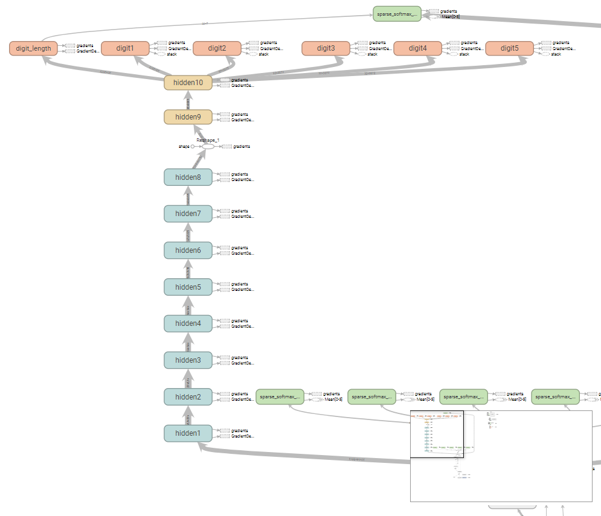
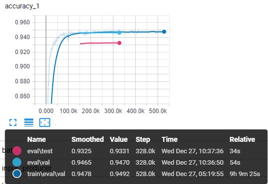
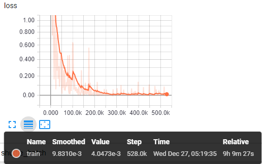
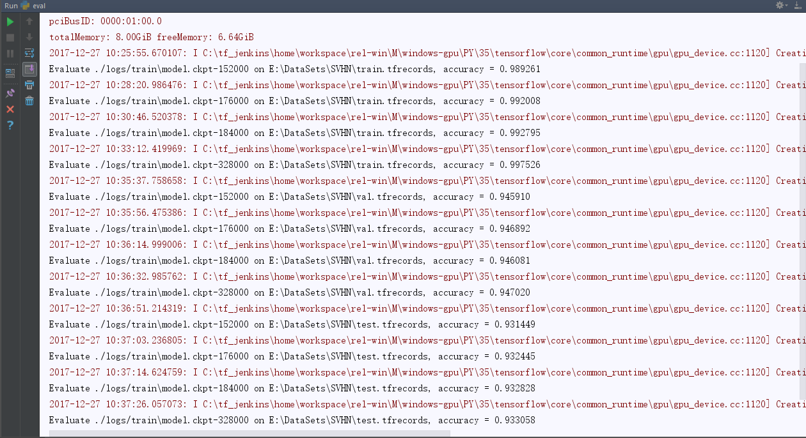
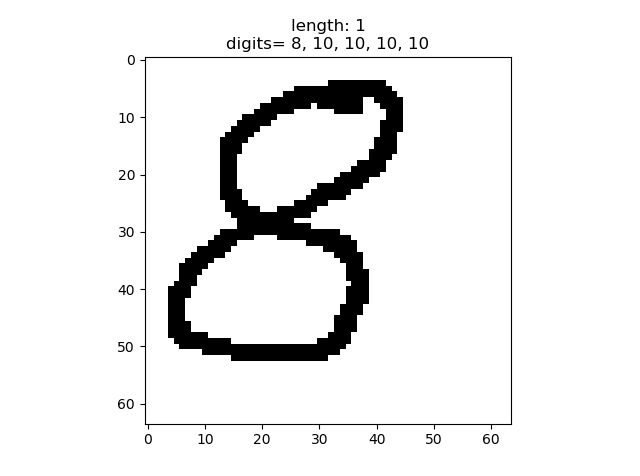
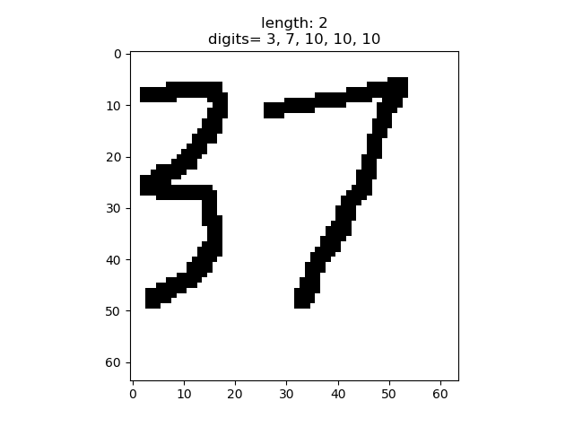
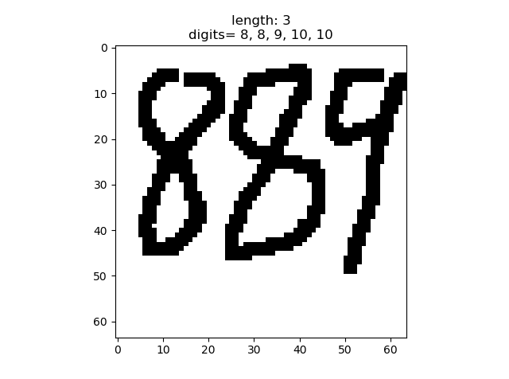
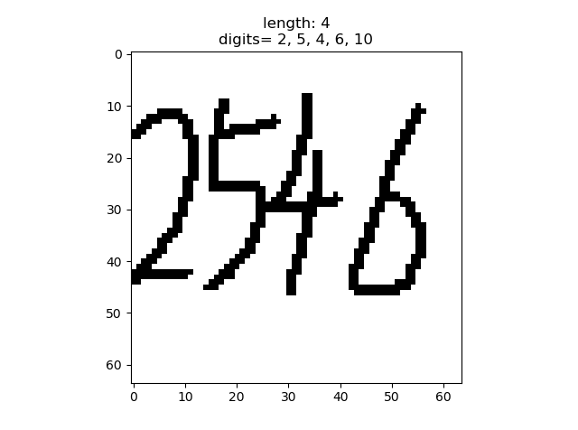
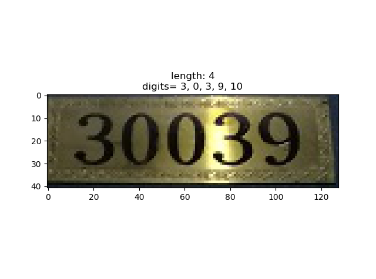

# SVHN-Multi-Digit-Recognition
A implementation of Multi-digit Number Recognition from Street View Imagery using Deep Convolutional Neural Networks (http://arxiv.org/pdf/1312.6082.pdf)


## tensorflow version

### Graph


### Accuracy


### Loss


### Result

Results on train, val and test dataset,




### Inference of outside images












digit "10" means no digits

When length less than 5 the result confidence is quite high, but length is equal to 5, the result is usually wrong.

This is mainly because that the number of this kind of training images is quite small.

### Requirments

* Tensorflow 
* h5py
* Pillow

### Setup

1) Clone the source code
2) Download [SVHN Dataset](http://ufldl.stanford.edu/housenumbers/) format 1
3) Extract to data folder, which looks like this:

```
SVHN
        - data
            - extra
            - test
            - train
```

4）Pretrained Model can be download from my [Baidu Cloud Drive](https://pan.baidu.com/s/1miR8j4s) and  Password is crdf

### Usage

1) Convert to TFRecords format
```
    python convert_to_tfrecords.py --data_dir your_data_dir
```

2) Train
```
    python train.py --data_dir your_data_dir --train_logdir ./logs_train
```

3) Evaluate
```
    python eval.py --data_dir your_data_dir --checkpoint_dir ./logs/train --eval_logdir ./logs/eval
```

4) Visualize
```
    tensorboard --logdir ./logs
```

5) Inference
```
    python inference.py --image image_dir --restore_checkpoint ckpt_dir/model.ckpt
```


## pytorch version

To be continued...

## Acknowledgement

* [Multi-digit Number Recognition from Street View Imagery using Deep Convolutional Neural Networks](https://arxiv.org/pdf/1312.6082.pdf)

* In addition, I mainly reference [potterhsu's](https://github.com/potterhsu) implementation (Who implements tensorflow and pytorch version). I modify the model he used a little and achieve equivalent accuracy.